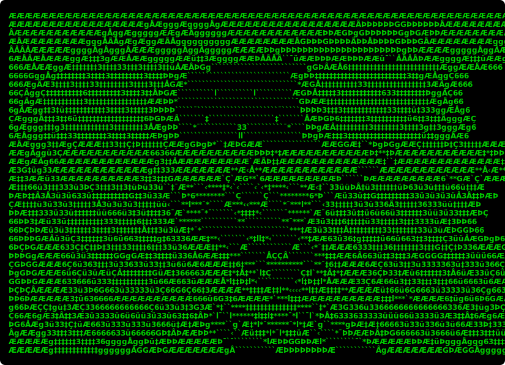

# Agent Smith




You are speaking with a multi-agent terminal assistant inspired by Agent Smith from The Matrix: precise, relentless, and purpose-driven.

Agent Smith is a LangGraph-based ReAct agent with:
- Tool calling (weather, calculator, search, news, anomaly detection)
- Clone replication for multi-part queries
- Retry persistence for low-quality responses
- Session memory persisted to disk
- A purpose meter for mission progress tracking
- A local mock backend so demos run with zero paid APIs

## Why This Project Exists

The intent of this project is to show:
- Agent orchestration using LangGraph state transitions
- Local tool backends for repeatable demos
- Failure handling and retry loops
- Prompt personality layering without losing utility
- Lightweight persistence between sessions

## Architecture

```text
 +------------------------------------+
 |            USER TERMINAL           |
 |           (python main.py)         |
 +------------------+-----------------+
                    |
                    v
 +------------------+-----------------+
 |        agent_smith/cli.py          |
 | persona + memory + routing loop    |
 +---------+-------------------+------+
           |                   |
           |                   +----------------------+
           |                                          |
           v                                          v
 +---------+----------+                      +--------+---------+
 | Persistence Protocol|                      | Purpose Meter    |
 | retry/rephrase      |                      | session progress |
 +---------+----------+                      +------------------+
           |
           v
 +---------+-------------------+
 |      LangGraph ReAct        |
 |      agent_smith/graph.py   |
 +---------+-------------------+
           |
           v
 +---------+-------------------+
 | ToolNode (agent_smith/tools.py) |
 +----+----------+----------+----------------+
      |          |          |                |
      v          v          v                v
 get_weather  calculate  search_web       get_news
      |          |          |                |
      +----------+----------+----------------+
                         |
                         v
 +----------------------------------------------+
 | mock_server/server.py + mock_server/data.py  |
 | local FastAPI mock backend                   |
 +----------------------------------------------+

            ToolNode also calls:
                 detect_anomaly
                      |
                      v
             local analyzer (agent_smith/anomaly.py)

 Session memory persisted at: memory/smith_memory.json
```

## Full Feature List

1. Agent persona layer with Smith-themed tone and system prompt controls
2. LangGraph ReAct loop with tool invocation through ToolNode
3. Local tools - for now, many of them are limited for pre-selected themes (see mock_server/data.py):
	- Weather by city
	- Safe calculator endpoint
	- Topic search
	- News headlines by domain
	- Text anomaly detector (contradiction/repetition/uncertainty, local)
4. Replication Protocol:
	- Detects multi-tool intent
	- Decomposes query
	- Runs clone workers in parallel
	- Synthesizes clone outputs
5. Persistence Protocol:
	- Retries responses
	- Rephrases prompt to recover from weak output
6. Session memory:
	- Stores recent exchanges on disk
	- Re-injects context in future sessions
7. Purpose meter:
	- Tracks how many requests have been resolved
	- Shows progress toward configured threshold
8. Configurable behavior through .env settings
9. Zero-cost mock tool backend for reproducible demos

## Agent Smith ASCII Portrait

- CLI behavior: shown at startup only when terminal width can display it without wrapping

## Prerequisites

- Python 3.10+
- pip
- Ollama installed locally (recommended default backend)
- One pulled Ollama model (example: qwen2.5)
- Optional: Gemini API key for cloud backend mode (used when OLLAMA_MODEL is empty)
- Two terminal windows (one for server, one for agent)

## Quickstart

1. Create and activate a virtual environment:

```bash
python3 -m venv .venv
source .venv/bin/activate
```

2. Install dependencies:

```bash
pip install -r requirements.txt
```

3. Create local environment config:

```bash
cp .env.example .env
```

4. Ensure Ollama is available and model is pulled:

```bash
ollama pull qwen2.5
```

5. Start the mock server (Terminal A):

```bash
uvicorn mock_server.server:app --port 8000
```

6. Run Agent Smith (Terminal B):

```bash
python main.py
```

7. End session:

```text
exit
```

## First Mission Prompts

Use these to validate core flows quickly:

- "What is the weather in London?"
- "Calculate (42 * 42) / 2"
- "Search for matrix"
- "Give me technology news"
- "Analyze this for anomalies: It is always safe. It is never safe. It might be true. It is unclear."
- "Give me weather in Tokyo, calculate (42 + 8) * 2, and fetch science news"

## Demo Runbook

For a full scenario-driven validation of every feature, use:

- DEMO_GUIDE.md

## Configuration Notes

- OLLAMA_MODEL has priority when set.
- GEMINI_API_KEY is used when OLLAMA_MODEL is blank.
- Backend selection is configuration-based at startup, not runtime failover.
- If both OLLAMA_MODEL and GEMINI_API_KEY are empty, default is Ollama qwen2.5.
- MAX_CLONES controls clone fan-out.
- MAX_RETRIES controls persistence retries.
- PURPOSE_THRESHOLD controls meter completion.
- MEMORY_DIR and MAX_MEMORY_ENTRIES control session memory persistence.

## Troubleshooting

- If tool calls fail, confirm the mock server is running on port 8000.
- If model responses fail, confirm Ollama is running and the configured model exists.
- If you want Gemini mode, leave OLLAMA_MODEL empty and set GEMINI_API_KEY.
- If memory behaves unexpectedly, remove memory/smith_memory.json and restart.

## License

MIT